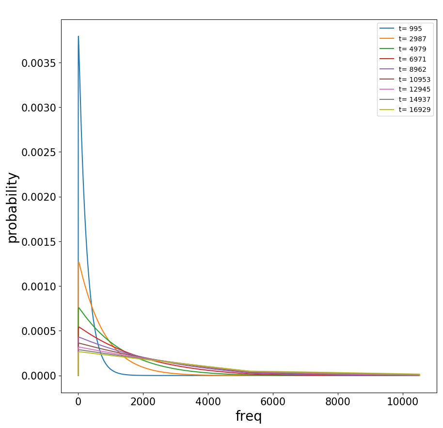

## Site Frequency Spectrum

In this directory we rely Markov Chains to model allele frequency  evolution. 

### I. Introduction. 

Uniform Ne. Number and SFS of segregating alleles.

- [notebook](https://nbviewer.jupyter.org/github/SantosJGND/MCM/blob/master/Pop_gen_PA/SFS_MCM_PA.ipynb).

### II. Changing Ne. 

Varying Ne as a function of time. Explore effect for single population.

- [notebook](https://nbviewer.jupyter.org/github/SantosJGND/MCM/blob/master/Pop_gen_PA/NE_change.ipynb).

### III. Branching.

Incorporate MCM single population simulations into a complete a demographic model simulator. 

- [notebook](https://nbviewer.jupyter.org/github/SantosJGND/MCM/blob/master/Pop_gen_PA/Branching.ipynb)

### Appendix

- Coalescent time and Fst: [notebook](https://nbviewer.jupyter.org/github/SantosJGND/MCM/blob/master/Pop_gen_PA/FST_Coal_MCMtest.ipynb)

**example**

Frequency probability if segregating alleles of different ages for example species:

## Practical 

### I. Mutation count.

Task: count mutation number by type from genotype array using matrix multiplication. 

> [notebook](https://nbviewer.jupyter.org/github/SantosJGND/MCM/blob/master/Pop_gen_PA/Benchmark.ipynb)